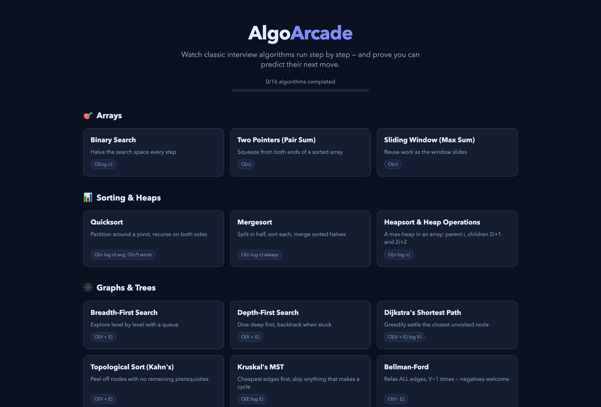
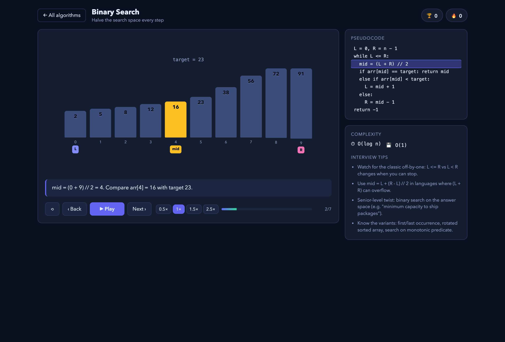
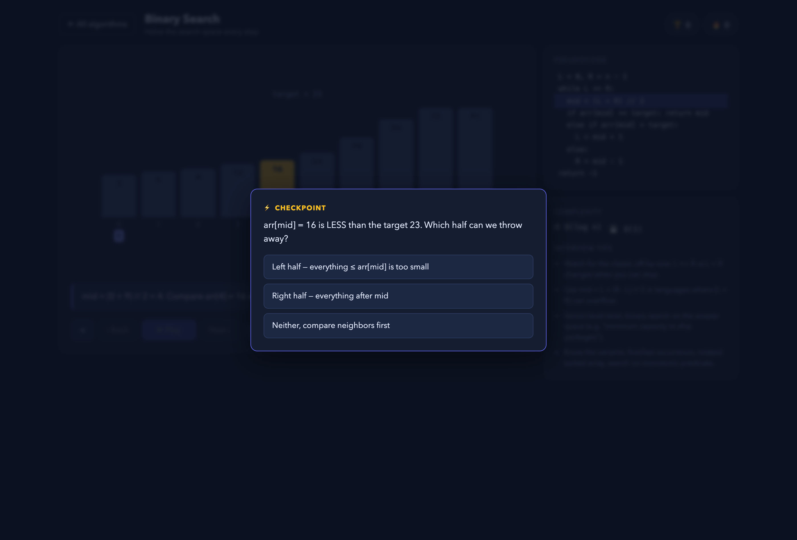
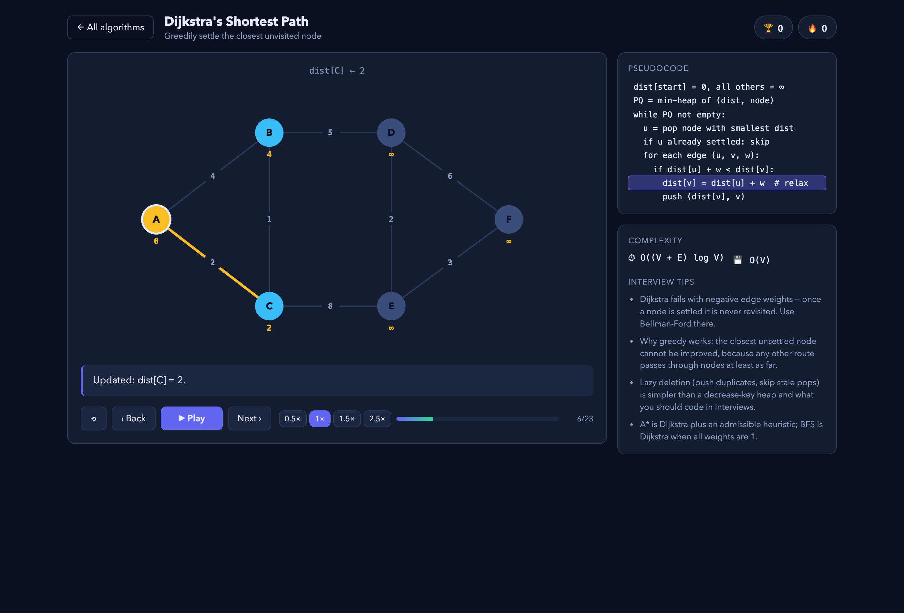

# AlgoArcade

**Interview algorithms, animated — watch them run, then prove you can predict their next move.**

AlgoArcade is an interactive learning game for engineers preparing for senior/staff-level interviews at big tech. Instead of passively reading about algorithms, you watch them execute step by step with synchronized pseudocode — and the playback periodically stops at ⚡ checkpoints that quiz you on what happens next. Correct answers build score and streaks; every algorithm ships with complexity analysis and interview tips.



## The learning loop

1. **Watch** — every algorithm runs as a smooth animation: pointers sweeping arrays, nodes lighting up as a graph is explored, DP tables filling in cell by cell. The current pseudocode line highlights in sync.
2. **Predict** — playback pauses at checkpoints: *"arr[mid] = 16 is LESS than the target 23. Which half can we throw away?"* You answer before the animation reveals it.
3. **Retain** — each answer explains the underlying invariant. Each algorithm carries complexity facts and senior-level interview tips ("why is buildMaxHeap O(n)?", "why does Dijkstra fail on negative edges?").





## Algorithms covered (16)

| Category | Algorithms |
| --- | --- |
| 🎯 Arrays | Binary Search · Two Pointers (Pair Sum) · Sliding Window |
| 📊 Sorting & Heaps | Quicksort · Mergesort · Heapsort & Heap Operations |
| 🕸️ Graphs & Trees | BFS · DFS · Dijkstra · Topological Sort (Kahn's) · Kruskal's MST · Bellman-Ford · Floyd-Warshall |
| 🧩 Dynamic Programming | Memoization (Fibonacci) · 0/1 Knapsack · Longest Increasing Subsequence |



## Running locally

```bash
npm install
npm run dev      # http://localhost:5173
```

No backend, no accounts — progress and best scores persist in `localStorage`.

## How it works

Every algorithm is a pure **step generator**: it runs the real algorithm once and emits a sequence of immutable state snapshots (`Step[]`), each with a description, a pseudocode line to highlight, and optionally a quiz. Three shared visualizers render any snapshot:

```
src/
├── types.ts               # Step, Quiz, ArrayState / GraphState / TableState
├── algorithms/            # one generateSteps() per algorithm
│   ├── arrays.ts
│   ├── sorting.ts
│   ├── graphs.ts
│   └── dp.ts
├── components/
│   ├── Player.tsx         # playback engine: play/pause/step/speed, quiz gating, scoring
│   ├── QuizOverlay.tsx
│   ├── Home.tsx
│   └── viz/               # ArrayViz (bars/pointers/windows), GraphViz (SVG), TableViz (DP grids)
└── progress.ts            # localStorage persistence
```

**Adding an algorithm** = writing one `AlgoModule` object (metadata + pseudocode + tips + `generateSteps()`) and registering it in `src/algorithms/index.ts`. No UI work needed — the player and visualizers are fully generic.

## Tech

React 19 · TypeScript · Vite · hand-rolled CSS (no UI libraries) · SVG graph rendering

## License

MIT
